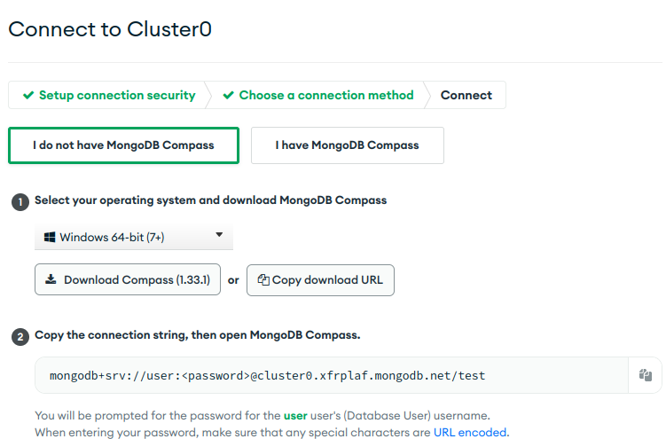

# Starter Kit and Resources for MongoDB operations

## Recommended Setup
We will need two things:

- Mongo DB (the actual database)
- Mongo Compass (the client/GUI to work on)

## MongoDB

MongoDB is a cross-platform document-oriented database program. Classified as a NoSQL database program, 
MongoDB uses JSON-like documents with optional schemas

There are several installation options.

### Atlas

Assuming that you have Compass installed or you will install it during this process.

This is the MongoDB cloud environment. 
- Go to https://www.mongodb.com/cloud/atlas
- Create an account or sign in.
- You will be prompt to create an organization (most likely).
  
- Create one by giving a name (let other options as is)
  
- Skip the Add members part by clicking Create Organization
  
- When this is done you will be directed in Projects page. Pick New Project from the upper right corner and it will land you in new project creation. Add a name and click next
    
- Again skip the add members part and create the project
- Then you will be prompt to create a Database:
   
- Pick the free option:
    
- In the next step you should pick Cloud provider, location etc. You can go with defaults, just check the mongo version in the bottom.
It should be 5.0.x
    

    
- When you will click create cluster Atlas will provision your instance and this may take some minutes.
- As soon as this is done you will be prompt to security quickstart.
- Add username and password (something simple that you can remember for instance user/user) and create the user.
    
- Add 0.0.0.0 in IP access list, add the entry, and keep checked the My Local Environment option.
    
- You should be all setup now and get this prompt:
    
    Click to go to databases
- You will see something like this:
  
- Click on connect and select Compass from the popup
    
- If you do not have Compass already you can download it from here.
- Copy the given connection string
    
- Open compass application and in the connections create a connection with the given connection string
    
- Click connect and you should be able to see something like this:

- That's it! You can now query the atlas cluster from your Compass.

### Local

Go to https://www.mongodb.com/try/download/community
- Download the package for your OS.
- If your package manager prompts to install mongo compass allow it.
- Go through with the default options
- As soon as this is done search for compass applciation and open it. 
- Use the default connection string to connect to your database

### Docker

- Pull the Mongo image: `docker pull mongo`
- Execute docker run: `docker run -d -p 27017:27017 --name test-mongo mongo:latest`
- Open Compass. use the default URI to connect `mongodb://localhost:27017`
- You should be able to see something like this:
    

## Compass

- If you did not install Compass during the Mongo installation you can go here:
https://www.mongodb.com/try/download/compass and simply download it for your OS
- The first time it will run it will prompt for a connection string. The default will be `mongodb://localhost:27017`
- Use this if you have a local installation or if you run it in docker

